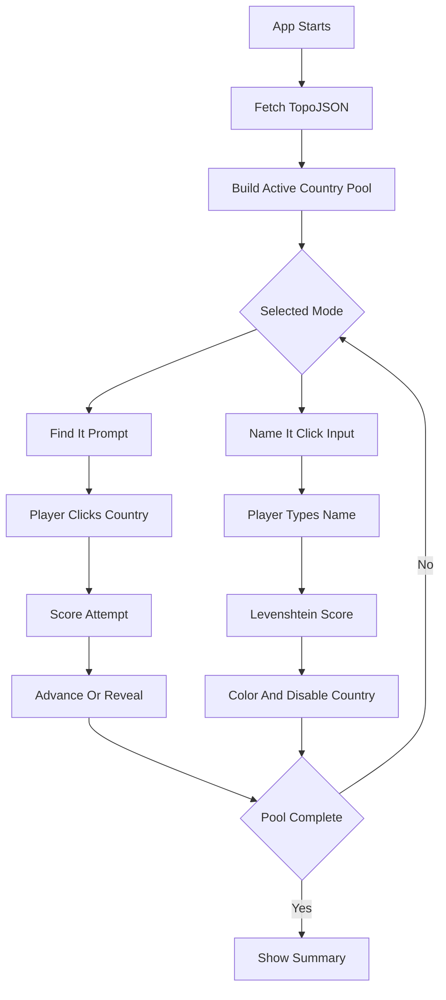

# Geography Guessing Game Plan

## Approach

Build a new Vite React + TypeScript project in the empty workspace, add Tailwind CSS plus `d3`, `topojson-client`, and their TypeScript types, then implement the game around a single centralized state hook and reusable D3 map component.

## Key Files

- [package.json](package.json): add scripts and dependencies for Vite, React, Tailwind, D3, and TopoJSON.
- [src/App.tsx](src/App.tsx): compose the full-screen layout, control bar, map, active mode panel, and summary modal.
- [src/components/Map.tsx](src/components/Map.tsx): fetch `https://cdn.jsdelivr.net/npm/world-atlas@2/countries-110m.json`, convert TopoJSON to GeoJSON, render SVG countries, apply D3 zoom/pan, fit selected continents, dim inactive countries, and route country clicks.
- [src/components/ControlBar.tsx](src/components/ControlBar.tsx): render continent filter, mode selector, score, remaining count, streak, and reset button.
- [src/components/FindItMode.tsx](src/components/FindItMode.tsx): prompt `Find: [Country Name]`, handle two-attempt scoring, wrong flash, reveal-on-miss, and confirm-to-advance behavior.
- [src/components/NameItMode.tsx](src/components/NameItMode.tsx): selected-country panel, thumbnail outline SVG, input submission, fuzzy scoring labels, and completed-country color coding.
- [src/hooks/useGameState.ts](src/hooks/useGameState.ts): manage mode, continent, shuffled country queue/pool, score, attempts, streak, completed statuses, selected country, and round reset.
- [src/data/countries.ts](src/data/countries.ts): map numeric ISO IDs from world-atlas to country name, continent, and alternate spellings for fuzzy matching.
- [src/utils/levenshtein.ts](src/utils/levenshtein.ts): reusable edit-distance function and name normalization helpers.

## Game Flow

## Implementation Steps

1. Scaffold the app with Vite React TypeScript and install Tailwind, D3, TopoJSON, and required type packages.
2. Configure Tailwind and base CSS for a full-screen dark UI with smooth SVG fill transitions.
3. Populate `countries.ts` with world-atlas numeric ISO country IDs, continent assignments, display names, and useful alternate spellings.
4. Implement `levenshtein.ts` with normalized comparisons so Mode 2 can accept exact and near matches consistently.
5. Implement `useGameState.ts` to centralize pool filtering, queue shuffling, scoring, attempt tracking, streaks, status colors, and reset behavior.
6. Implement `Map.tsx` using D3 projection/path/zoom, TopoJSON conversion, continent fitting, country dimming, hover/click behavior, status colors, and thumbnail path support.
7. Implement `FindItMode.tsx`, `NameItMode.tsx`, `ControlBar.tsx`, and the end summary modal in `App.tsx`.
8. Run typecheck/build and fix any compile issues.

## Testing And Verification

- Verify `npm run build` completes successfully.
- Manually exercise both modes: correct/wrong scoring, second-attempt behavior, reveal confirmation, fuzzy matches, completed-country lockout, reset, continent filtering, and world summary breakdown.
- Check map interactions: pan, zoom, continent fit, dimmed inactive countries, hover state, and responsive full-height layout.